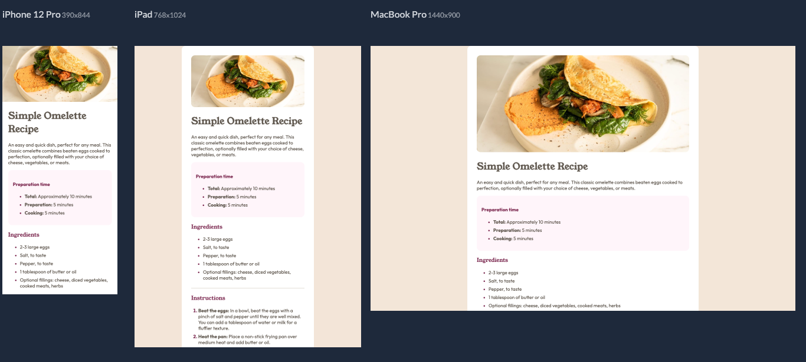

# Frontend Mentor - Recipe Page Solution 🧁

This is my solution to the [Recipe page challenge](https://recipe-one-sable.vercel.app) on Frontend Mentor.


## Overview ✨

### The Challenge

Users should be able to:

- View the optimal layout for the site depending on their device's screen size.
- See all hover states for interactive elements on the page.

### Preview

 


## My Process 🛠️

### Built with

- **Semantic HTML5 markup** - Used meaningful tags like `<main>`, `<section>`, `<article>`, and `<figure>`.
- **CSS Custom Properties** - For colors and fonts, making the design easy to maintain.
- **Flexbox** - For layout and centering content.
- **Mobile-first workflow** - Designed for mobile first, then adapted for desktop.

### What I learned 💡

This project was a great practice for CSS. I focused on improving my skills in:

- **Responsive Design:** Used media queries to adjust the layout for different screen sizes.
- **CSS Variables:** Implemented custom properties to manage colors efficiently.
- **List and ::marker styling:** Learned to style ordered lists and control the appearance of numbers using the `::marker` pseudo-element.

Here's a code snippet reference:

```css
li::marker {
  color: var(--color-rose-800);
  font-weight: bold;
}
```

### **👥 Solved by M Olaya** 
<a href="https://www.linkedin.com/in/molaya">LinkedIn</a> 
